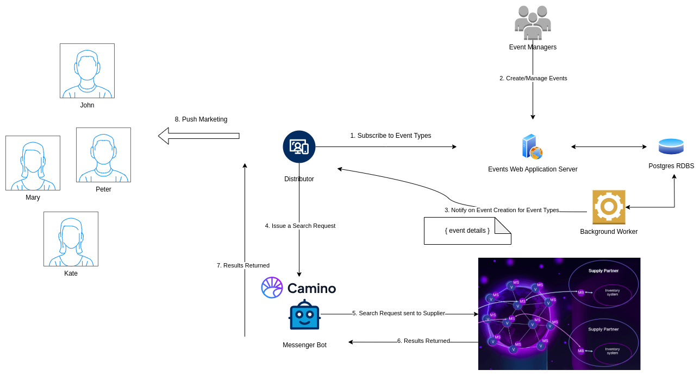

# Decode Travel May 2025 - Crete

This is one of two repositories created and developed
as par tof the Decode Travel occurred in May 2025, at Crete.

# The Main Idea

Personalized hotel recommendations.
Travellers are notified for hotel offers related to their
interests.

# Components

- Events Service. This repository
- Camino Distributor Partner. [Other repository](https://github.com/teonetmatch/CaminoHackathonApi)
- Camino Network

# Architecture Diagram

# Production

The Events Service is online [here](https://events-service-voja.onrender.com/)

# Usage

Read the readme at the other repository [here](https://github.com/teonetmatch/CaminoHackathonApi)
